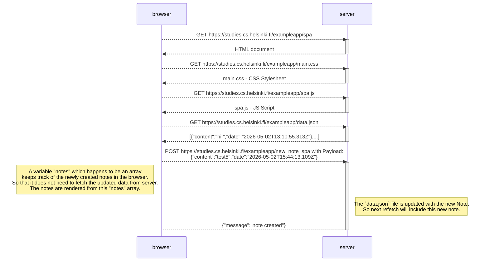

## Spa Notes Application Flow along with Note Creation - Sequence Diagram

```mermaid
sequenceDiagram
    participant browser
    participant server

    browser-->>server: GET https://studies.cs.helsinki.fi/exampleapp/spa
    activate server
    server-->>browser: HTML document
    deactivate server

    browser-->>server: GET https://studies.cs.helsinki.fi/exampleapp/main.css
    activate server
    server-->>browser: main.css - CSS Stylesheet
    deactivate server

    browser-->>server: GET https://studies.cs.helsinki.fi/exampleapp/spa.js
    activate server
    server-->>browser: spa.js - JS Script
    deactivate server

    browser-->> server: GET https://studies.cs.helsinki.fi/exampleapp/data.json
    activate server
    server-->>browser: [{"content":"hi ","date":"2026-05-02T13:10:55.313Z"},...]
    deactivate server

    browser-->>server: POST https://studies.cs.helsinki.fi/exampleapp/new_note_spa with Payload: <br/> {"content":"test5","date":"2026-05-02T15:44:13.109Z"}
    activate server
    
    Note left of browser: A variable "notes" which happens to be an array <br/>keeps track of the newly created notes in the browser. <br/>So that it does not need to fetch the updated data from server. <br/> The notes are rendered from this "notes" array.
    Note right of server: The `data.json` file is updated with the new Note. <br/>So next refetch will include this new note.

    server-->browser: {"message":"note created"}
    deactivate server
```
