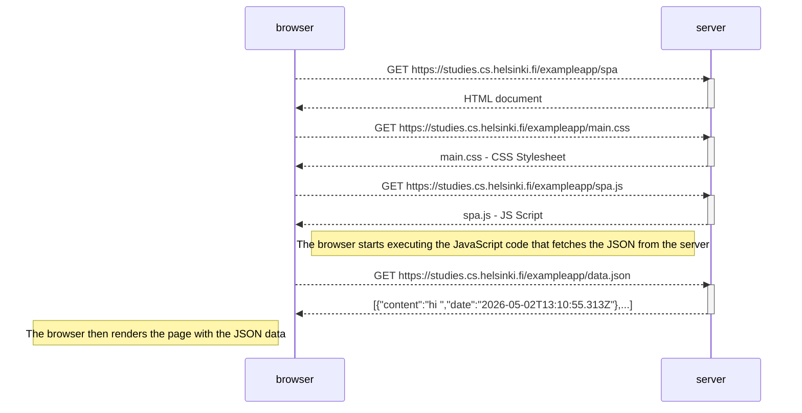

## Spa Notes Application Flow - Sequence Diagram

```mermaid
sequenceDiagram
    participant browser
    participant server

    browser-->>server: GET https://studies.cs.helsinki.fi/exampleapp/spa
    activate server
    server-->>browser: HTML document
    deactivate server

    browser-->>server: GET https://studies.cs.helsinki.fi/exampleapp/main.css
    activate server
    server-->>browser: main.css - CSS Stylesheet
    deactivate server

    browser-->>server: GET https://studies.cs.helsinki.fi/exampleapp/spa.js
    activate server
    server-->>browser: spa.js - JS Script
    deactivate server
    
    Note right of browser: The browser starts executing the JavaScript code that fetches the JSON from the server

    browser-->> server: GET https://studies.cs.helsinki.fi/exampleapp/data.json
    activate server
    server-->>browser: [{"content":"hi ","date":"2026-05-02T13:10:55.313Z"},...]
    deactivate server

    Note left of browser: The browser then renders the page with the JSON data
```
